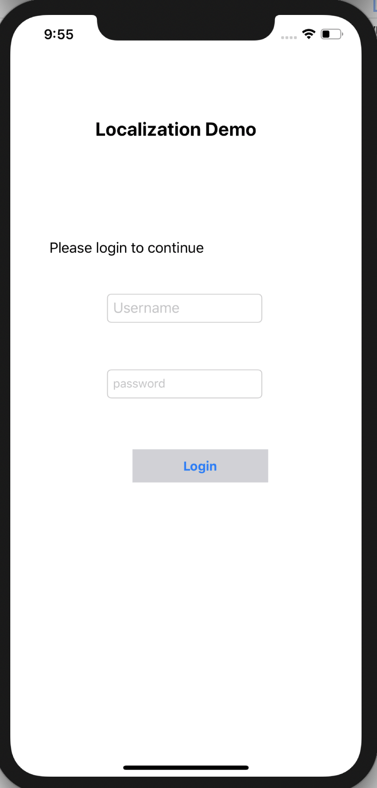
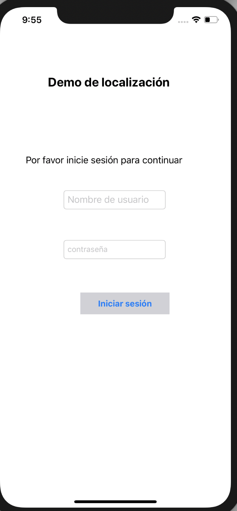

# localizationDemo

This project is a sample project which shows how to create iOS app to support different regions. 
Added 2 language support (English, Spanish).

## Localization:
Localization is the process of customizing your app to work in other languages other than the default.
Internationalization needs to come one step ahead of the mobile app localization process as your code needs to be ready to handle the localized content when it’s created.

## Internationalization
Internationalization is the process of customizing your code so that it’s ready for localization and able to be modified and released in multiple languages

